# **The Humble Grape**
## **Site Overview**
Dive into the world of wine!

Join The Humble Grape in celebrating the art of wine. Wine is a creative process, science meets art, to create those distinctive tastes you have experienced. Wine is enjoyed with all the senses not just how it tastes but how it looks, how it smells you can even tell the texture of a wine through the glass! 

The Humble Grape is a space to share what you have tried, to allow others to experience it. To discuss with others great wines or great vineyards or maturation styles. As well as learn about the history of wine, how the technique has developed over the centuries and how technology and science is now enhancing the art.

## Table of contents:
1. [**Site Overview**](#site-overview)
1. [**Planning stage**](#planning-stage)
    * [***Target Audiences***](#target-audiences)
    * [***User Stories***](#user-stories)
    * [***Site Aims***](#site-aims)
    * [***How Is This Will Be Achieved:***](#how-this-will-be-achieved)
    * [***Wireframes***](#wireframes)
    * [***Color Scheme***](#color-scheme)
    * [***Technology used***](#technology-used)
    * [***Languages used***](#languages-used)
 1. [**Current Features**](#current-features)
    * [***Main body:***](#main-body)
        * [*Home page*](#home-page)
        * [*Profile page*](#profile-page)
        * [*Other pages*](#other-pages)
        

    * [**Footer**](#footer)
1. [**Future-Enhancements**](#future-enhancements)
1. [**Testing Phase**](#testing-phase)
    * [*Testing*](#testing)
        * [*Testing User Stories from User Experience (UX) Section*](#testing-user-stories-from-user-experience-ux-section) 
        * [*Further Testing*](#further-testing) 
1. [**Accessibility**](#accessibility)
1. [**Known Bugs**](#known-bugs)
1. [**Deployment**](#deployment)
1. [**Credits**](#credits)
    * [**Honourable mentions**](#honourable-mentions)
    * [**Content**](#content)
    

## **Planning stage**
### **Target Audiences:**
* Those who enjoy wine.
* Those who may be within the wine industry looking for a community or knowledge sources.
* Those who have loved ones who enjoy wine and are looking to impress them with new knowledge or wines to taste.

### **User Stories:**
* As a user, I want to see wines which have been recommended by others and the reasons why.
* As a user, I want to be able have a space to save the wines I have tasted for future reference.
* As a user, I want to find others who may want to discuss wine in more detail.
* As a user, I want hear others experiences and wine activities that I may want to partake in 
* As a user, I want to be able to share my experiences and activities with others.

### **Site Owners Aims:**
* To create a community of wine lovers
* To get a wider range of wine options and reviews
* To share and gain knowledge 

### **How This Will Be Achieved:**
* Users will have a profile to add the wines they have tasted. They will be able to leave a review for others to see.
* Users will be able to search for wines to find inspiration.
* Users will be able to follow others who are of interest and add wines to their wish list.
 
### **Wireframes:**
I used Balsamiq to create a visual representation of the Travel site - below are the initial idea designs:

* Desktop Wireframes:
    * 
    * 
    * 
   

### **Color Scheme:**
As my favourite wine is a red wine, it was only fitting that this website have a deep ruby red colour scheme. Reds and pinks have been used with the hope that it represents wine.

### **Technology Used:**
## Languages Used

-   [HTML5](https://en.wikipedia.org/wiki/HTML5)
-   [CSS3](https://en.wikipedia.org/wiki/Cascading_Style_Sheets)
-   [JavaScript] (JavaScript | MDN (mozilla.org))
-   [Python] (Python | (https://www.python.org/))

### Frameworks, Libraries & Programs Used

1. [Jinja:](https://jinja.palletsprojects.com/)
    - Jinja was used as a template inheritance framework throughout the project. It allowed me to inject data from the database into the website dynamically.
2. [Flask:](https://flask.palletsprojects.com/)
    - Flask is a python framework to enable my backend functionality to be displayed to the web browser for user interaction.   
3. [Materialise:](https://materializecss.com/)
    - Materialise is a CSS framework which enabled me to style my website and apply functionality.   
4. [Font Awesome:](https://fontawesome.com/)
    - Font Awesome was used for icons throughout the website including within the footer.
5. [Git](https://git-scm.com/)
    - Git was used for version control by utilizing the command line terminal to commit to Git and Push to GitHub.
6. [GitHub:](https://github.com/)
    - GitHub was used to store the project code after being pushed from Git.
7. VIDEO EDITING SOFTWARE
8. [Balsamiq:](https://balsamiq.com/)
    - Balsamiq was used to create the wireframes during the design process.
9. [ImageColorPicker:](https://imagecolorpicker.com/)
    -Image Color Picker was used to select the colors throughout the site. 

## **Current Features **
###  **Main body**
The main body of all the web pages is derived from a base template, which then creates a template for all other pages. The base template included the nav bar, mobile nav bar and footer.

### **Home Page** 
The home page - wine.html - is where users will see wines which have been recommended by others alongside thier reviews. Users who have registers for the site will also be displayed here. This is available for all users. This information is dynamically generated from the database to the website. If a user registers, further functionality is avilable on the home page to allow users to add wine's to their 'wish list' and to follow other users. 

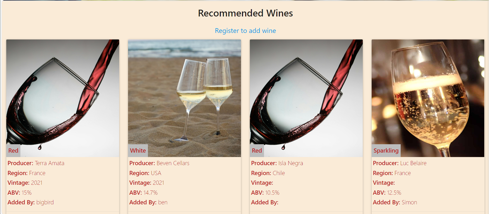

### **Profile Page**
This page allows the user to further populate their profile details including their favourite wine colour or wine region, as well as change their profile picture. This information is additional to the user profile questions needed for registration, but are added to the database once submitted, allowing for the information to be used in other areas of the website.

Here users can also edit or delete wines they have entered. This functionality is only available to those who have registered. Defensive programming has also been used here to enable users to confirm if they want to delete a wine added.

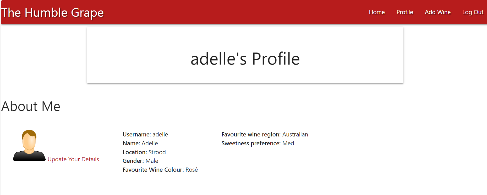
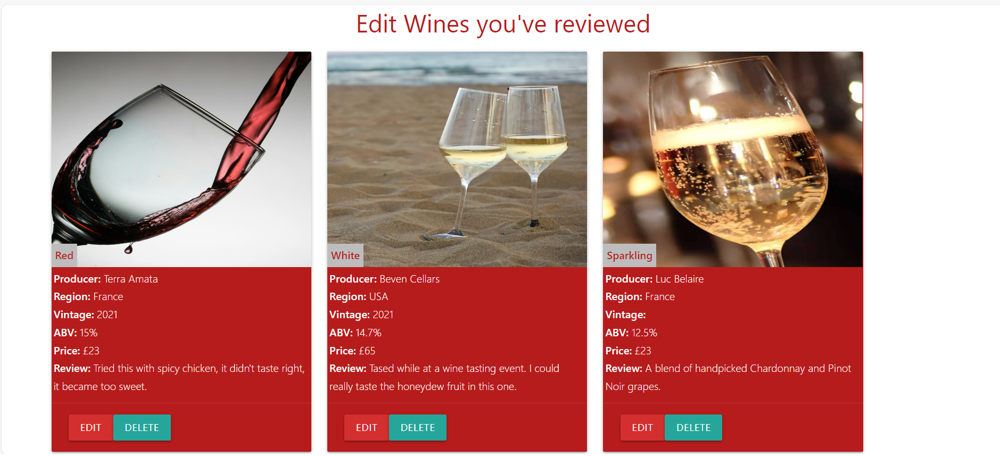

### **Other pages**
The users who are not logged in will be able to see a registration/ login page for them to complete. 
Users who have logged in will also see a 'Add Wine' page, which is where they can add new wines to their profile and the database. Here users can select if they would recommend the wine, and this wine profile will then be displayed on the home page for other users to see.

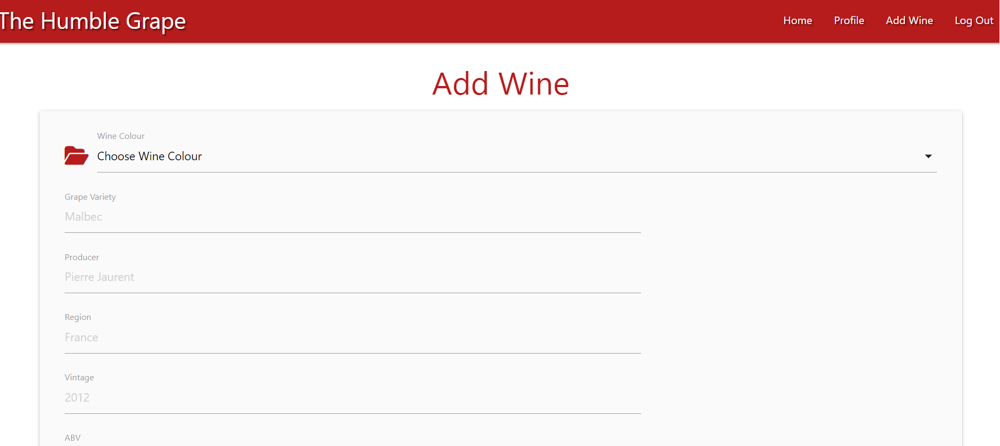
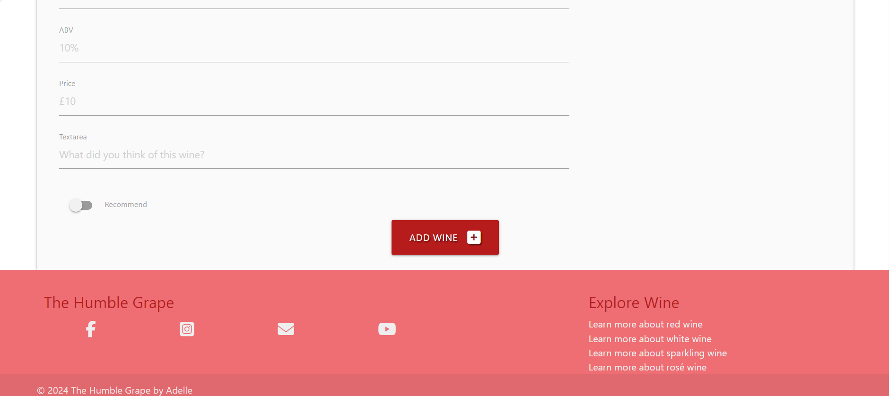
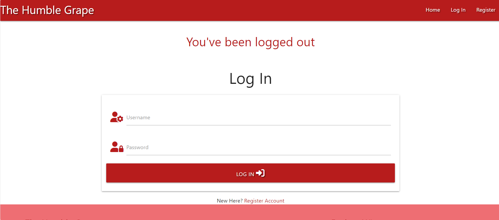
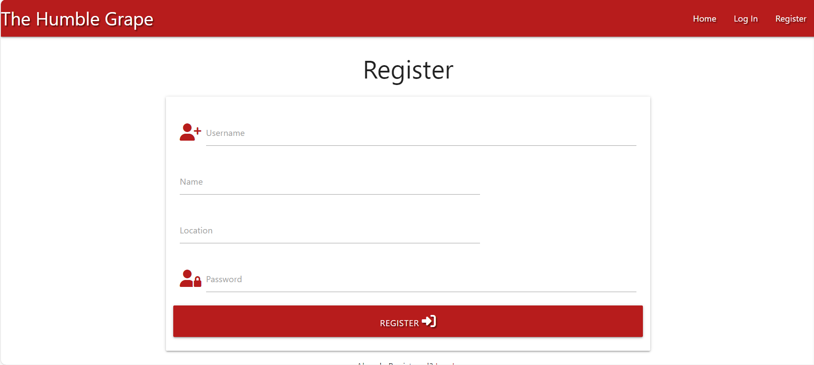

## **Future-Enhancements**

* I wanted to add a search functionality to the website, but my limited access to MongoDB didn't allow for this functionality.
* The wines and users profiles displayed on the homepage should be limited to a certain number, this functionality will be added at a later date.
* The ability for users to add wine to their wish list and/or follow users would be a great feature for this site.
* It would also be good if users could take a photo of the wine they have reviewed and this would be added to their review and to the homepage. 
* Additional pages for education and information will be added.
* Local wine events could also enhance this site, wine tasting sessions or social meetups.
* Larger scale trips could also be a feature, vineyard tours within the UK or abroad could be arranged.

### **Testing Phase**

## **Testing**

    My project was tested using external validation tools. This helped me to improve my code and ensure it remains compliant and accessible. 

    HTML:

-   [W3C Markup Validator](https://validator.w3.org) 
    
    All pages were tested using the W3C HTML checker. Errors were actioned. 

    CSS:

    [W3C CSS Validator](https://jigsaw.w3.org/css-validator) 

    All pages were tested using the W3C CSS validator, errors relating to the Materalise framework were found. But no errors relating to the custom CSS added.
    
    
    Javascript:

    There were no erros identified within the console log within the browser 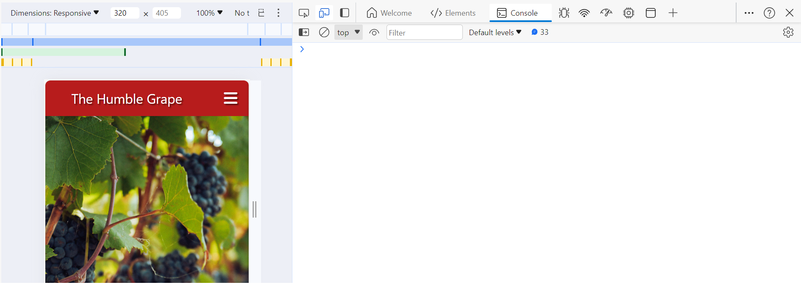
    

### Testing User Stories from User Experience (UX) Section

1)	As a user, I want to see wines which have been recommended by others and the reasons why:
a.	users and visitors can see wines recommened by others and read any reviews left by the taster. 
b.	Registered users also have the option to add wines to a wish list for future tasting.
c. This could be improved by being able to add multiple reviews for one wine should someone else try the wine, currently a user who has tried a wine already in the database would need to re-add the wine to submit a review. 

2)	As a user, I want to be able have a space to save the wines I have tasted for future reference.
a.	Users will be able to see wines they have saved to their wish list in their profile area.
b. This could also be improved by enabelling the user to select if the wine they have uploaded to the database has been tasted and leave a review or to be saved to their wish list area - wihtout tasting and review details.

3)	As a user, I want to find others who may want to discuss wine in more detail.
a.	Future functionality will enable users to 'follow' others. 
b.	This functionality could also be extended to allow users to talk to each other through their profile pages. 

4)	As a user, I want hear others experiences and wine activities that I may want to partake in 
a.	Future functionality will include users ability to post meetups and events to continue the wine discussion offline. 

5)	As a user, I want to be able to share my experiences and activities with others.
a.	Future functionality could be to have a noticeboard within the site to allow users to post things they have done which may interest others, without needing to create an event. 

### Further Testing

-   The Website was tested on Google Chrome, Internet Explorer and Microsoft Edge.
-   The website was viewed on a variety of devices such as Desktop, Laptop and android phones.
-   A large amount of testing was done to ensure that all pages were linking correctly.
-   Friends and family members were asked to review the site and documentation to point out any bugs and/or user experience issues.

### Accessibility
I wanted to ensure the site supported all visitors, I included the following in my code to ensure this:

* The site is responsive to different screen sizes 
* I used semantic elements throughout the design

### ***Known Bugs***
*  Users cannot  use the 'wish list' and 'follow' buttons as the code for these has not been written.
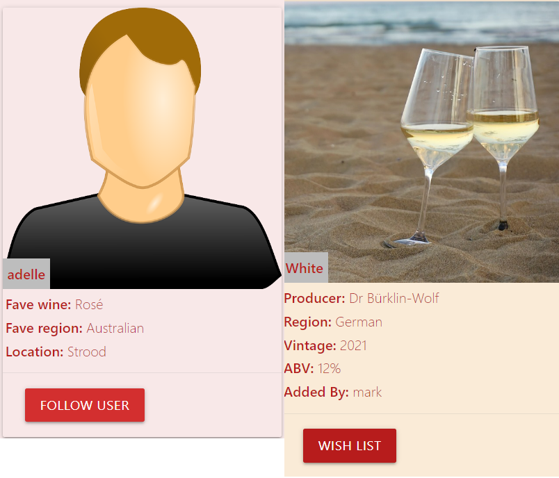

* There are too many results appearing on the main page from the recommended wine section and the user profile section, makeing the page busy and overwhelming. 

*  I'd like to be able to add the reveiews left on the wines added to the main page. But because of the varying lengths meant the page formatting was misaligned.
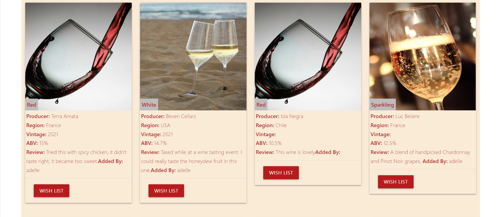

* There is some white space on the home page which I am unable to remove.
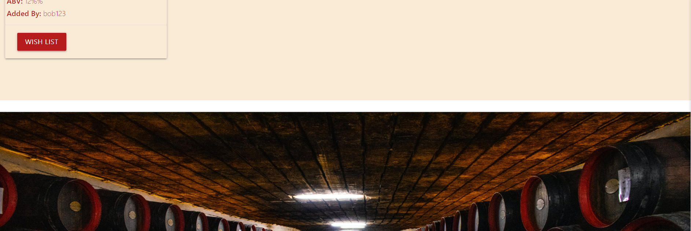
  

## **Deployment**
I website has been added to Git and GitHub to enable version control. I then uploaded it to heroku for hosting. I was also able to obtain a custom domain www.thehumblegrape.com to further add a professional finish to the site. 

***
## **Credits**
### **Honourable mentions**
I’d like to thank the Code Institute tutors who spent time walking through my idea and how best to create the functionality.
* I used W3schools, youtube and stack overflow for general "how to's" throughout the project alongside course material from Code Institute. 

### **Content:**
* Most of the content was written by myself.
* Icons in the forms were taken from [Font Awesome](https://fontawesome.com) 
* Pictures were used from  [Pexels](https://www.pexels.com/) 

